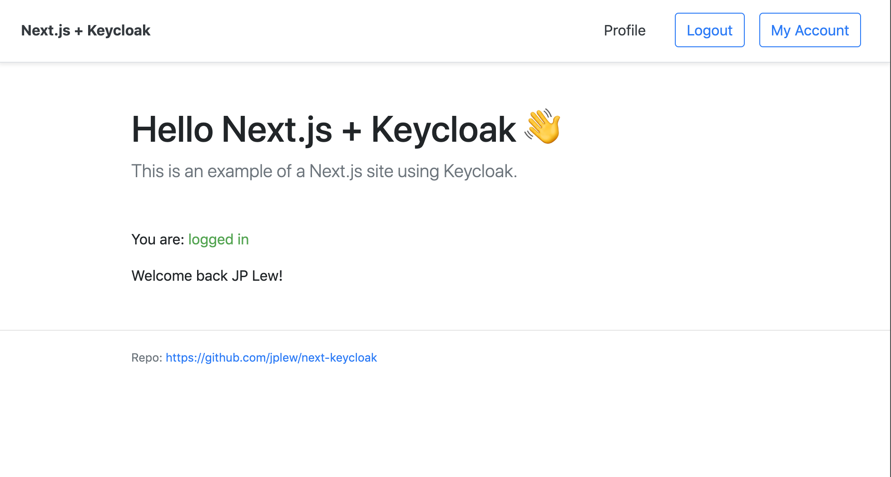

# -------------------------
## Note: This example repo is deprecated

Since my last commit, panz3r added SSR support to his NPM package: [@react-keycloak/ssr](https://www.npmjs.com/package/@react-keycloak/ssr). Use that since it is being actively maintained.

# -------------------------


# Next.js + Keycloak Example

This is a simple project demonstrating how to integrate a Next.js app with [Keycloak](https://www.keycloak.org).

It uses Typescript, taking advantage of the typings provided by [Keycloak's JS Adapter](https://www.npmjs.com/package/keycloak-js) and [panz3r's react-keycloak](https://www.npmjs.com/package/react-keycloak) package.



## Dependencies

- Node.js
- Docker

## Installation

### a) Launch the Keycloak server

1. `cd keycloak`
2. `docker-compose up`

### b) Launch the web client

1. `npm install`
2. `npm run dev`

## Usage

You can access the `keycloak` object from any component using the `useKeycloakContext` React Hook:

```js
import { useKeycloakContext } from "../utils/context"

const { keycloak, keycloakInitialized } = useKeycloakContext()

if (keycloakInitialized && keycloak.authenticated) {
  console.log(`Welcome back ${keycloak.tokenParsed.name}!`)
} else {
  console.log("Hello visitor, please log in.")
}
```

**Note:** React Hooks are preferable over Higher Order Components since you don't have to specify the Keycloak props in every function signature.

## About This Example

Our `KeycloakProvider` component is straight up copied from panz3r's excellent `react-keycloak` package (https://github.com/panz3r/react-keycloak).

The reason we're re-implementing it here rather than importing it is because running `import { KeycloakProvider } from 'react-keycloak'` will cause any SSR framework like Next.js to crash.

Why? Because `react-keycloak` bundles up JBoss's `keycloak-js` (https://www.keycloak.org/docs/6.0/securing_apps/index.html#_javascript_adapter), which in turn invokes the `window` object. Since `window` is undefined on the server, it causes the import to crash.

This example circumvents this problem by loading the Keycloak JS adapter only on the client-side.

The second problem implementing Keycloak with SSR is in managing the UI state: there can be both an "authenticated" version of the UI and an "unauthenticated" one.

In a SPA, this state is determined on the client-side by the JS adapter which stores this data in a session cookie in the browser.

This authentication state is typically inacessible to the server, causing the server to always render the "logged-out" state. This results in "component flashing", wherein the "logged-in" state of the UI blinks into being once Keycloak is initialized.

This example prevents this blinking effect by passing a custom cookie to the server containing the app's current authentication state. For example, the navbar will render the "Logout" and "My Account" buttons on the server, rather than waiting for confirmation from the client.

Note: the user info will "blink on" right now, but only because we aren't storing that data in the cookie as well.

## Contribution

Pull requests and ideas welcome.
